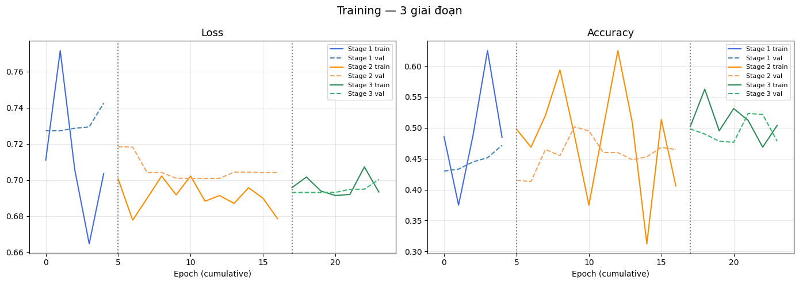
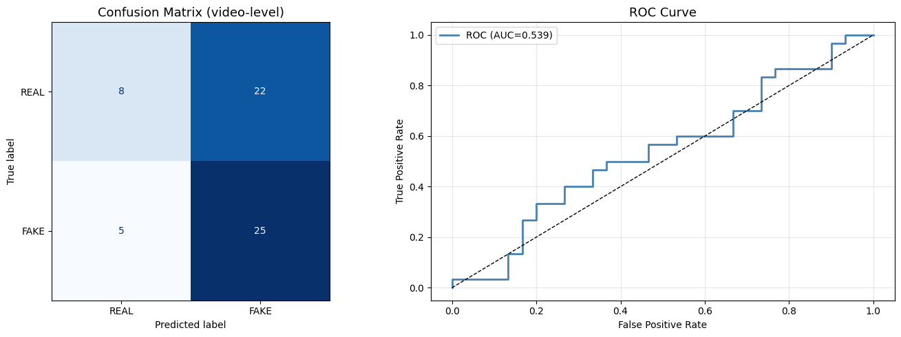
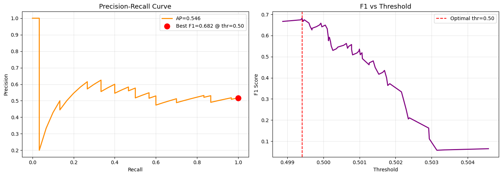
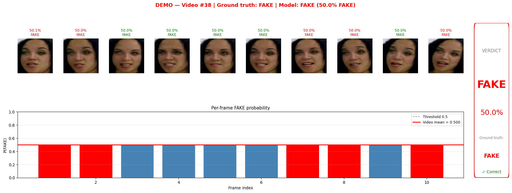

# 🛡️ DeepFake Detection System (MTCNN + Xception)

Hệ thống phát hiện video giả mạo (**DeepFake Detection**) sử dụng kiến trúc **Xception** kết hợp với **MTCNN face detection** và chiến lược **motion-based frame selection** để phát hiện các artifacts bất thường trong video. Pipeline được tối ưu cho tập dữ liệu **FaceForensics++**.

---

## 📋 Mục lục

* [Tổng quan](#-tổng-quan)
* [Pipeline hệ thống](#-pipeline-hệ-thống)
* [Kiến trúc mô hình](#-kiến-trúc-mô-hình)
* [Training Strategy](#-training-strategy)
* [Kết quả đánh giá](#-kết-quả-đánh-giá)
* [Phân tích kết quả](#-phân-tích-kết-quả)
* [Demo Inference](#-demo-inference)
* [Cài đặt](#-cài-đặt)
* [Sử dụng](#-sử-dụng)

---

## 🔍 Tổng quan

Bài toán: phân loại video thành **REAL** hoặc **FAKE** ở mức **video-level**.

### Ý tưởng chính

* Chỉ lấy các frame có chuyển động mạnh nhất để tăng xác suất bắt được DeepFake artifacts.
* Dự đoán từng frame bằng Xception.
* Trung bình xác suất của toàn bộ frame để đưa ra verdict cuối cùng.

---

## 🔄 Pipeline hệ thống

```text
Input Video
   ↓
MTCNN Face Detection
   ↓
Motion-based Frame Selection (Top-K Motion Frames)
   ↓
Face Crop + Resize 299x299
   ↓
Xception Classification
   ↓
Mean Aggregation
   ↓
Video-level Verdict
```

---

## 🧠 Kiến trúc mô hình

* **Backbone:** Xception pretrained on ImageNet
* **GlobalAveragePooling2D**
* **Dropout:** 0.5
* **Dense Softmax Head:** 2 classes (REAL / FAKE)

---

## 📈 Training Strategy

| Stage   | Mô tả                                  | Learning Rate |
| ------- | -------------------------------------- | ------------- |
| Stage 1 | Freeze backbone, train classifier head | 1e-3          |
| Stage 2 | Unfreeze 30 lớp cuối                   | 1e-4          |
| Stage 3 | Full fine-tuning                       | 1e-5          |

### Training Curves



---

## 📊 Kết quả đánh giá

### Classification Report (Video-level)

| Class            | Precision | Recall | F1-score   | Support |
| ---------------- | --------- | ------ | ---------- | ------- |
| REAL             | 0.6154    | 0.2667 | 0.3721     | 30      |
| FAKE             | 0.5319    | 0.8333 | 0.6494     | 30      |
| **Accuracy**     | -         | -      | **0.5500** | 60      |
| **Macro Avg**    | 0.5736    | 0.5500 | 0.5107     | 60      |
| **Weighted Avg** | 0.5736    | 0.5500 | 0.5107     | 60      |

---

### ROC / PR Metrics

| Metric                     | Score      |
| -------------------------- | ---------- |
| ROC-AUC                    | **0.5389** |
| Average Precision (PR-AUC) | **0.5462** |
| Best F1                    | **0.682**  |
| Optimal Threshold          | **0.50**   |

---

## 📉 Visualization

### Confusion Matrix + ROC Curve



### Precision Recall + Threshold Optimization



---

## 🧪 Demo Inference

### Ví dụ dự đoán trên video test



**Prediction Result:**

* Ground Truth: **FAKE**
* Model Prediction: **FAKE**
* Confidence: **50.0%**

---

## 📌 Phân tích kết quả

### Điểm mạnh

* Recall cho class **FAKE = 83.33%** → model bắt khá tốt DeepFake.
* Motion-based sampling giúp giảm số frame cần xử lý nhưng vẫn giữ signal mạnh.
* Pipeline inference nhanh, phù hợp deployment thực tế.

### Hạn chế hiện tại

* ROC-AUC còn thấp (**0.539**) → model mới nhỉnh hơn random baseline.
* Recall class REAL thấp (**26.67%**) → bias dự đoán về FAKE.
* Output probabilities đang tập trung quanh 0.5 → dấu hiệu model chưa học được boundary rõ ràng.

### Hướng cải thiện đề xuất

* Tăng dataset / augment mạnh hơn.
* Sử dụng temporal model (LSTM / Transformer / TimeSformer).
* Thay mean aggregation bằng attention pooling.
* Fine-tune threshold riêng cho business objective.

---

## 🚀 Cài đặt

```bash
git clone <your-repo-url>
cd DFD
pip install -r requirements.txt
```

---

## 💻 Sử dụng

```python
score, verdict = predict_video("path/to/video.mp4", model, detector)
print(f"Kết quả: {verdict} với {score*100:.2f}% xác suất là FAKE")
```

---

## 📂 Cấu trúc thư mục đề xuất

```text
project/
│
├── src/
│   ├── training_stages.png
│   ├── confusion_roc.png
│   ├── pr_threshold.png
│   └── demo_prediction.png
│
├── notebooks/
├── models/
├── README.md
└── requirements.txt
```

---

## 📜 License

MIT License
